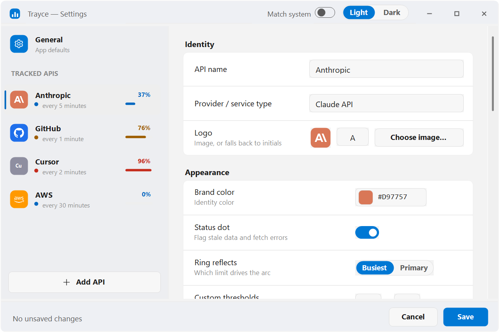
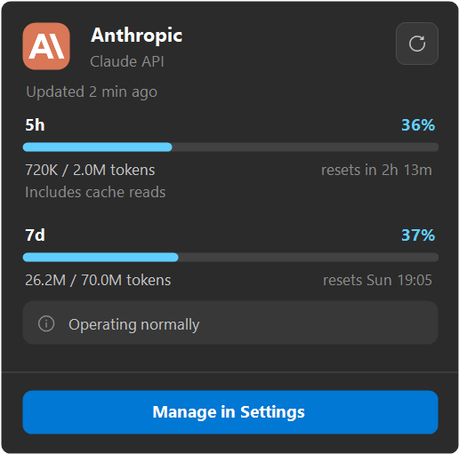
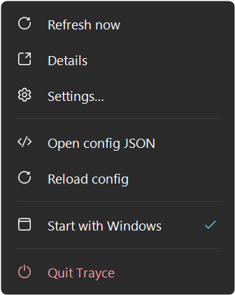

# Trayce

---


Lightweight Windows tray utility for watching API usage at a glance.

Current build: self-contained .NET 8 Windows tray app with one usage ring per configured API, custom brand/logo marks in the details surfaces, automatic bundled logo matching, stacked usage windows, light/dark themes, and per-monitor DPI-aware rendering.

Trayce can show static usage from local config or refresh live JSON from each API's configured `sourceUrl`. The tray icon shows a usage ring colored by health; hover, left-click, and right-click reveal progressively more detail.

[Download latest build](https://github.com/Geijoh/Trayce/releases/latest) - [Privacy policy](PRIVACY.md)

## Creation Note

Trayce was created with assistance from Claude Code, OpenAI Codex, and Claude Design. Project direction, review, and release decisions remain human-owned.

## System Requirements

Runtime:

- Windows 10 or Windows 11 desktop tray.
- 64-bit Windows.
- No separate .NET install is required for packaged releases; Trayce publishes as a self-contained app.
- Settings are stored in `%APPDATA%\Trayce\apis.json`.
- Cached usage state is stored in `%LOCALAPPDATA%\Trayce\state.json`.
- Optional: live usage endpoints that return Trayce-compatible JSON over HTTP or HTTPS.

Build:

- .NET SDK 8.0 or newer.
- Windows x64, matching the WinForms tray target.

## Screenshots








Refresh screenshots:

```powershell
.\tools\capture-screenshots.ps1
```

## Build

```powershell
dotnet restore
dotnet build --configuration Release
```

## Test

```powershell
dotnet run -- --self-test
```

## Try in the tray

```powershell
dotnet run
```

On first run, Trayce creates a sample config. Each configured API gets one tray icon.

- Hover for the summary tooltip.
- Left-click for the details flyout.
- Right-click for refresh, details, settings, config JSON, reload, startup toggle, or quit.
- Open settings to edit API identity, logo, brand color, source URL, poll cadence, usage windows, and automatic logo matching.

## Configure usage

Static usage can live directly in `%APPDATA%\Trayce\apis.json`:

```json
{
  "autoApplyPresetIcons": true,
  "apis": [
    {
      "id": "openai",
      "displayName": "OpenAI",
      "logoText": "AI",
      "brandColor": "#111827",
      "pollSeconds": 300,
      "usage": {
        "windows": [
          {
            "label": "5h",
            "metric": "tokens",
            "used": 180000,
            "limit": 500000,
            "resetsAt": "2026-06-17T16:00:00-07:00"
          }
        ]
      }
    }
  ]
}
```

For live usage, set `sourceUrl` to an HTTP or HTTPS endpoint that returns the same `usage` shape:

```json
{
  "id": "internal-meter",
  "displayName": "Meter",
  "logoText": "M",
  "brandColor": "#2563EB",
  "sourceUrl": "https://localhost:5001/usage.json",
  "pollSeconds": 60
}
```

Use `windows` for service-specific limits such as 5-hour, daily, weekly, or monthly quotas.

## Publish

```powershell
powershell -ExecutionPolicy Bypass -File .\scripts\package.ps1
```

Output:

```text
dist\Trayce-win-x64\
dist\Trayce-win-x64.zip
```

The GitHub workflow builds and packages the app on every push.
